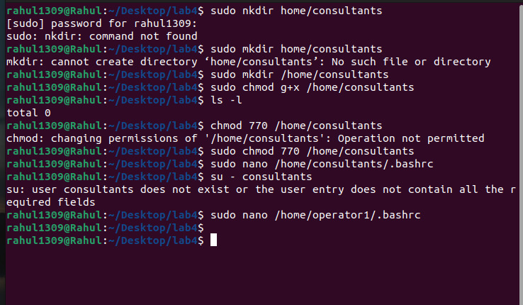

**Create the /home/consultants directory.
Add write permission to the consultants group. Use the
symbolic method for setting the appropriate permissions.
Forbid others from accessing files in
the /home/consultants directory. Use the octal method for
setting the appropriate permissions.
Change the default umask for the operator1 user. The new
umask prohibits all access for users that are not in their
group. Confirm that the umask is changed.**

**commands**

sudo mkdir /home/consultants
sudo chmod g+w /home/consultants
sudo chmod 770 /home/consultants
sudo nano /home/operator1/.bashrc
su - operator1
umask 007

