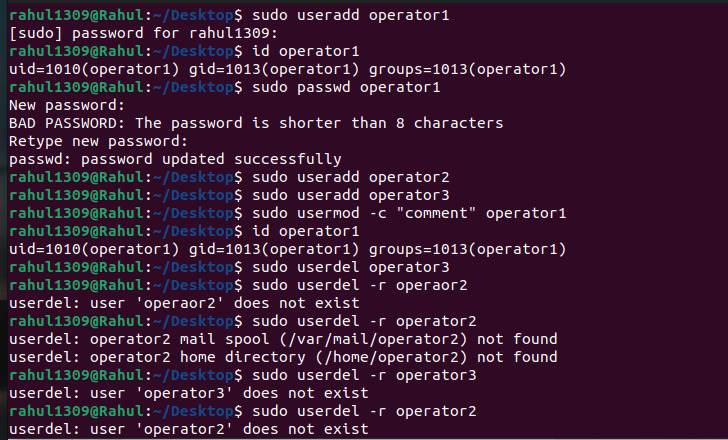

**Create the operator1 user and confirm that it exists in the
system. Set the password for operator1. Create the
additional operator2 and operator3 users. Set their
passwords as well. Run the usermod -c command to update
the comments of the operator1 user account. Remove
the operator3 user from the system.**

**commands**

sudo useradd operator1
id operator1
getent passwd operator1
sudo passwd operator1
sudo useradd operator2
sudo useradd operator3
sudo passwd operator2
sudo passwd operator3
sudo usermod -c "First Operator User" operator1
sudo userdel operator3
sudo userdel -r operator3

