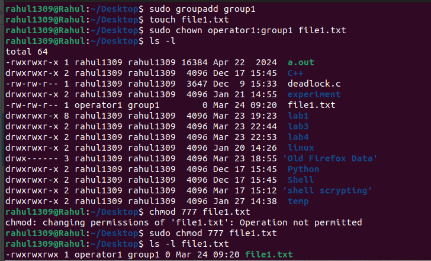

**Implement chown, chmod command with their options**

**commands**

chown [owner][:group] filename
sudo chown john file.txt
sudo chown john:staff file.txt
sudo chown -R john:staff /path/to/directory
chmod 755 file.txt

also do it like
chmod u+x file.txt
chmod o-w file.txt
chmod g+rw file.txt
ls -l to see the changes 

